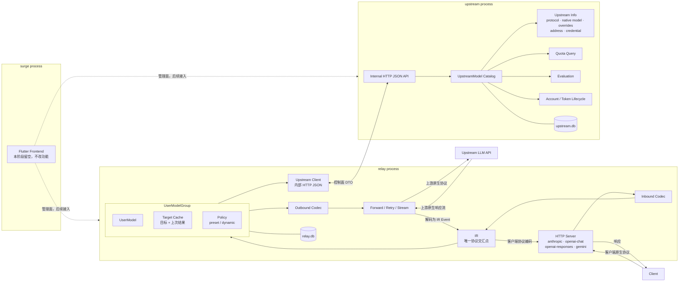
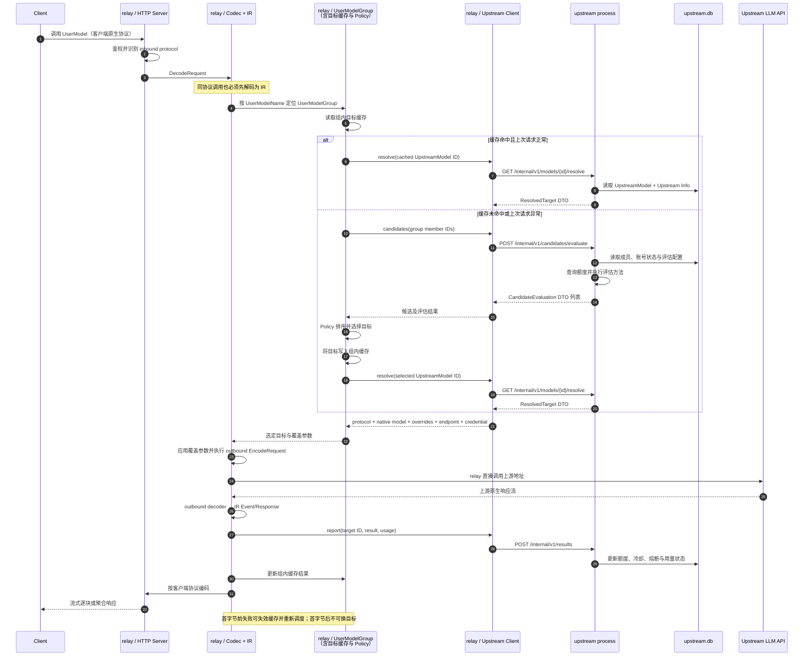

# ModelSurge 三进程架构设计

> 2026-09-13 定案。系统拆分为 `surge`、`relay`、`upstream` 三个独立进程。`relay` 与 `upstream` 各自拥有独立 SQLite，不跨库直连。

## 一、进程职责

| 进程 | 职责 | 持久化 |
|---|---|---|
| `surge` | 前端管理界面；沿用现有 Flutter 工程，本阶段保留但不改功能 | 无 |
| `relay` | 客户端 HTTP 接入、UserModel、UserModelGroup、Policy、组内目标缓存、inbound/outbound codec、IR、上游请求执行、重试、流控与响应回写 | `relay.db` |
| `upstream` | UpstreamModel、Upstream Info、上游账号与凭据、token 生命周期、模型目录、额度查询、评估与运行状态 | `upstream.db` |

`relay` 与 `upstream` 通过内部 HTTP JSON API 通信。该接口只传控制面 DTO，不传客户端或上游协议原始字节。

## 二、强制不变式

1. 所有请求都严格执行：`客户端原生协议 → inbound codec DecodeRequest → IR → outbound codec EncodeRequest → 上游原生协议`。
2. 所有响应都严格反向经过：`上游原生协议 → outbound codec 解码 → IR Event/Response → inbound codec 编码 → relay HTTP Server → Client`。
3. 即使源协议和目标协议相同，也必须经过 IR，禁止透传、旁路和同协议快捷路径。
4. `relay` 是协议数据面的唯一执行者；`upstream` 只提供候选、凭据、覆盖参数、额度和评估结果。
5. `relay.db` 与 `upstream.db` 由所属进程独占；进程之间不得直接读取对方 SQLite。
6. 向客户端写出首字节前可失效缓存、重新调度并换候选；写出后锁定当前目标，错误只能按客户端协议在流内返回。

## 三、组件图



## 四、串行时序图



## 五、进程接口

内部 API 只监听 loopback 或容器私网，并由独立 service key 鉴权。

| 方法 | 路径 | 用途 |
|---|---|---|
| `GET` | `/internal/v1/models` | 返回可用 UpstreamModel 摘要，供组成员配置与模型列表使用 |
| `GET` | `/internal/v1/models/{id}/resolve` | 返回一次调用所需的 ResolvedTarget |
| `POST` | `/internal/v1/candidates/evaluate` | 对指定组成员执行额度查询与评估，返回候选状态 |
| `POST` | `/internal/v1/results` | 上报调用结果与 usage，更新账号/模型运行状态 |
| `GET` | `/internal/v1/health` | 进程健康检查 |

`ResolvedTarget` 至少包含：

```text
upstream_model_id
protocol
native_model
request_overrides
base_url
credential / headers
runtime metadata（例如 Kiro token、region、host）
```

凭据仅在内部受信网络按单次 resolve 返回，不写入 `relay.db`，也不得进入日志、错误体或诊断响应。

## 六、数据归属

### relay.db

| 数据 | 说明 |
|---|---|
| `user_models` | UserModelName、客户端协议、客户端接入密钥、启用状态 |
| `schedule_groups` | UserModel 到调度组的映射、Policy 配置 |
| `schedule_group_members` | 调度组内有序 UpstreamModel ID 引用 |
| `target_cache` | 每个 UserModelGroup 当前目标、上次结果、更新时间 |

目标缓存属于 UserModelGroup，并与组配置写在同一数据库事务域内。

### upstream.db

| 数据 | 说明 |
|---|---|
| `accounts` | 服务商账号、凭据、token 来源、冷却与凭据状态 |
| `upstream_models` | UpstreamModel、协议、native model、请求覆盖参数、账号关联 |
| `quota_state` | 额度窗口、查询结果与更新时间 |
| `model_state` | 模型级失败、429、熔断与评估状态 |
| `usage_log` | 按账号和 UpstreamModel 记录用量 |

## 七、缓存与故障语义

- **快路径**：缓存命中且上次请求正常时，直接 resolve 缓存的 UpstreamModel，跳过额度查询、评估和 Policy 排序。
- **慢路径**：缓存未命中、目标不存在、resolve 失败或上次请求异常时，请求 upstream 评估候选，由 relay 的 Policy 排序并写回新目标。
- **进程不可用**：upstream 不可用且 relay 无法 resolve 目标时，relay 在写出首字节前返回客户端协议对应的可重试错误，不使用过期凭据兜底。
- **配置变化**：删除或禁用 UpstreamModel 后，resolve 返回 not found/unavailable；relay 立即使对应组内缓存失效。
- **结果上报**：upstream 的运行状态更新与 relay 的目标缓存更新分别落各自数据库，接口必须幂等，允许安全重试。

## 八、迁移与部署

1. 保留客户端四协议端点与鉴权行为。
2. 现有 Flutter 工程已迁移为 `surge/`，本阶段不改变功能。
3. 新增 `relay` 与 `upstream` 两个可执行入口和独立配置。
4. 旧账号 SQLite 只读迁移到 `upstream.db`；迁移可重复执行，不删除或改写旧库。
5. `relay.db` 初始化 UserModel、UserModelGroup、成员引用与目标缓存结构。
6. Compose 同时启动 `upstream`、`relay`；`relay` 等待 upstream health ready 后对外服务。
7. 迁移期间保留金丝雀测试，验证 4×4 协议转换与同协议强制 IR 路径。

## 九、代码边界

| 进程 | 代码职责 |
|---|---|
| `surge` | `surge/`（Flutter 管理前端，本阶段功能保持不变） |
| `relay` | HTTP Server、codec、IR、normalize、UserModelGroup、Policy、目标缓存、Forwarder、upstream HTTP client |
| `upstream` | 现账号接入能力、Kiro token 生命周期、UpstreamModel/Info、额度与评估、内部 HTTP Server |
| 共享 | 仅版本化控制面 DTO；不得共享数据库 Store、运行时 Manager 或协议 transport |

物理目录可以共享 Go module 以复用 codec/IR，但两个生产入口必须分别构建为独立二进制，并且运行时没有进程内 Manager 直连。
