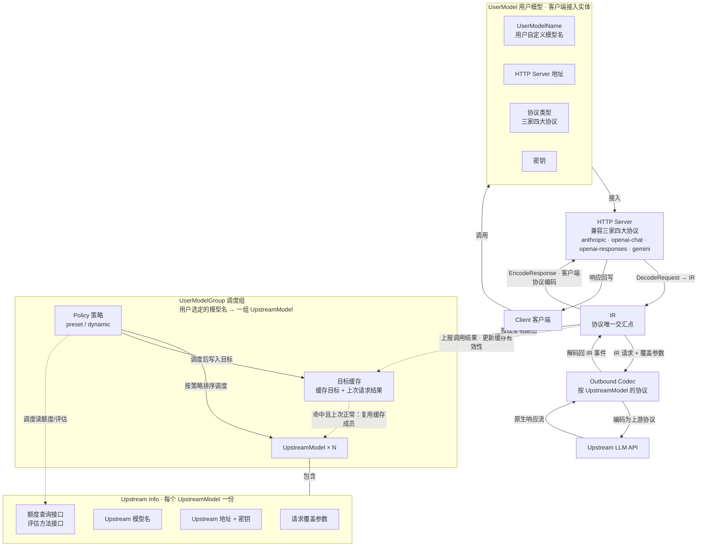
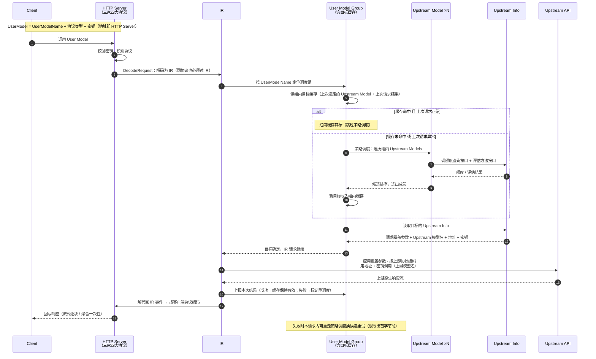

# relayd 调度架构设计图

> 2026-09-13 定案。核心原则：**所有协议（客户端侧 + 上游侧）任何一步都必须经 IR 交汇，两两不直转；同协议（如 anthropic→anthropic）也必须先解码为 IR 再重新编码，禁止透传**。UserModelGroup / Upstream Info 是纯控制面，不经手协议字节。

## 一、数据闭环（请求/响应串行路径）

```text
请求：Client → HTTP Server（DecodeRequest）→ IR → Outbound Codec（EncodeRequest）→ Upstream API
响应：Upstream API → Outbound Codec（解码回 IR 事件）→ IR → HTTP Server（客户端协议编码 + 回写）→ Client
```

HTTP Server 是客户端侧唯一出入口；IR 永远不直接面对连接，只面对 codec。

## 二、组件图



## 三、时序图（含目标缓存）



**缓存语义**：

- 快路径（缓存命中且上次正常）：定位组 → 读缓存 → 直接取 Upstream Info 调上游，跳过整段策略调度（粘性调度，保上游 prompt cache 命中）
- 慢路径（未命中 / 上次异常）：完整走策略调度（额度查询 + 评估 → 排序 → 选成员），新目标写回缓存
- 结果上报是缓存生命周期钩子：成功保持有效，失败失效，下一请求自然落回慢路径

## 四、实体定义

**UserModel**（客户端看到的东西）：

| 字段 | 说明 |
|---|---|
| UserModelName | 用户自定义模型名 |
| HTTP Server 地址 | 客户端接入端点 |
| 协议类型 | 三家四大协议：anthropic / openai-chat / openai-responses / gemini |
| 密钥 | 客户端接入凭据 |

**UpstreamModel → Upstream Info**（调度组内每个成员携带）：

| 要素 | 说明 |
|---|---|
| 请求覆盖参数 + Upstream 模型名 | 转发前覆盖请求参数（叠加序 client < account < model）；native 模型名 |
| Upstream 地址 + 密钥 | 上游端点与凭据 |
| 额度查询接口 | 查询上游账号剩余额度 |
| 评估方法接口 | 评估可用性/成本，作为 Policy 调度依据 |

## 五、概念到代码包的映射

| 设计概念 | 代码落点 |
|---|---|
| UserModel / UserModelGroup / Policy / 目标缓存 | 新 `backend/schedule` + server 鉴权扩展 |
| UpstreamModel / Upstream Info | `account` 目录（store_v2 改表：user_models / schedule_groups / upstream_models） |
| HTTP Server（inbound codec） | `backend/server` |
| Outbound Codec | `backend/proto`（各协议 codec，含 normalize） |
| IR | `backend/ir`（Request/Response/流事件超集/Aggregator/Overrides） |
| 转发/重试/流控 | `backend/relay`（候选循环、pre-write 重试边界不变） |
