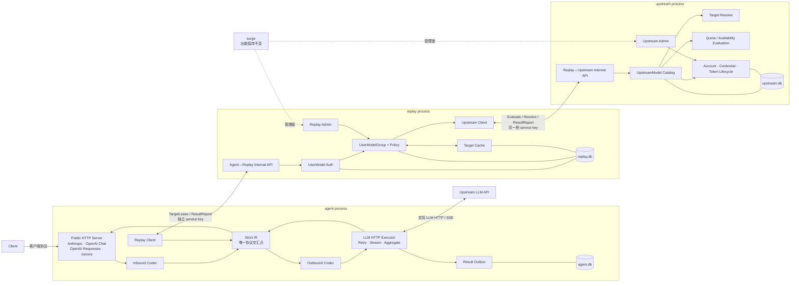
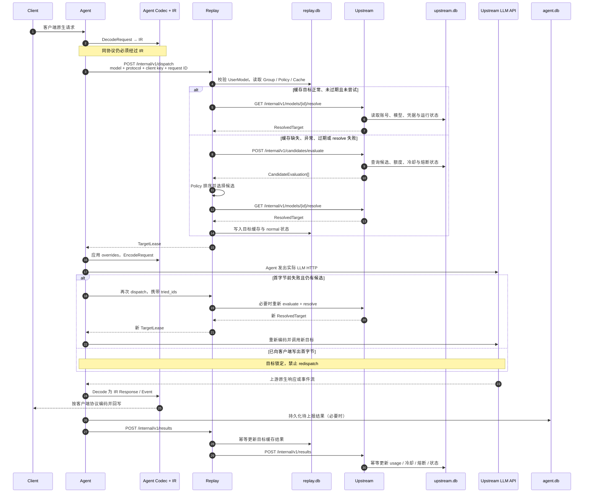

# ModelSurge 最终三模块架构

> 最终仓库边界为 `agent/`、`replay/`、`upstream/` 三个独立 Go module；`surge/` 保持现有 Flutter 功能不变。请求链路固定为 **Client → Agent → Replay → Upstream（控制面）**，实际 LLM HTTP 固定由 **Agent → Upstream LLM API（数据面）** 发出。

## 1. 模块职责

| 模块 / 进程 | 职责 | 持久化 |
|---|---|---|
| `agent` | 唯一对外 HTTP 入口；客户端鉴权；四种入站协议 codec；严格 IR 转换；每次请求向 Replay 获取 `TargetLease`；实际调用 LLM；流式/非流式响应编码；首字节前 redispatch；可靠结果上报 | `agent.db` |
| `replay` | UserModel、UserModelGroup、成员与 Policy；目标缓存；校验客户端模型与 key；为 Agent 调度并签发短期 `TargetLease`；缓存不可用时请求 Upstream 评估/解析；接收结果并转报 Upstream；Replay admin API | `replay.db` |
| `upstream` | 上游账号与凭据；UpstreamModel 目录；token 生命周期；模型解析；额度、冷却、熔断、可用性评估与 usage；Upstream admin API | `upstream.db` |
| `surge` | Flutter 管理前端；本次仓库收口不改变其功能 | 无 |

三个进程分别独占自己的 SQLite，禁止跨库读取。含短期凭据的 `TargetLease` / `ResolvedTarget` 只能在受信内部网络中传输，不得持久化到 Agent 或 Replay，也不得写入日志和错误响应。Agent→Replay 与 Replay→Upstream 使用两把不同的内部密钥。

## 2. 严格 IR 不变式

所有请求必须经过统一中间表示（IR）：

```text
客户端原生请求
  → inbound codec DecodeRequest
  → IR Request
  → 应用 TargetLease.request_overrides
  → outbound codec EncodeRequest
  → 上游原生请求
```

所有响应严格反向经过 IR：

```text
上游原生响应 / 事件流
  → outbound codec DecodeResponse / StreamDecoder
  → IR Response / Event
  → inbound codec EncodeResponse / StreamEncoder
  → 客户端原生响应
```

即使客户端协议与目标协议相同，也必须执行 `Decode → IR → Encode`，禁止原始 body、SSE frame 或协议 DTO 旁路。协议原始字节只在 Agent 内处理；Replay 和 Upstream 的内部 API 只传版本化 JSON DTO。

**Agent 是实际 LLM HTTP 的唯一发起者。** Replay 只返回 `TargetLease`，Upstream 只提供解析后的目标、凭据和运行状态，不代理模型推理流量。

### 2.1 协议方向支持矩阵

| 协议 | Agent 客户端入站 | TargetLease / UpstreamModel 出口 |
|---|---:|---:|
| Anthropic | 支持 | 支持 |
| OpenAI Chat Completions | 支持 | 支持 |
| OpenAI Responses | 支持 | 支持 |
| Gemini | 支持 | **禁止（inbound-only）** |
| Codex | 禁止 | 支持 |
| Kiro | 禁止 | 支持（独立账号类型） |

Gemini 的 `DecodeRequest`、`EncodeResponse`、`StreamEncoder`、错误渲染和 Agent 路由属于客户端入口面，必须保留。出口面采用显式 allowlist：`anthropic`、`openai-chat`、`openai-responses`、`codex`、`kiro`。Agent 在 `TargetLease → candidate` 边界拒绝 Gemini/未知协议；Replay 在签发租约前再次拒绝；Upstream 不接受、不探测、不物化、不发布且不解析 Gemini 出口模型。历史 Gemini account 可保留用于管理与迁移记录，但不得生成可调度 `upstream_models`。

## 3. 核心组件图



## 4. 串行请求时序



核心故障边界：**首字节前可 redispatch，首字节后目标锁定**。首字节前的连接失败、可重试状态、首事件超时或目标失效，可让 Agent 携带 `tried_ids` 再向 Replay 获取新租约；一旦向客户端写出任何响应字节，不得切换目标，只能按客户端协议完成流或返回流内错误。

## 5. 两段内部 API

两段 API 都使用 `/internal/v1`，但运行在不同服务上并使用独立 Bearer key。

### 5.1 Agent → Replay

鉴权：`Authorization: Bearer ${MODELSURGE_AGENT_REPLAY_KEY}`。

| 方法 | 路径 | 用途 |
|---|---|---|
| `GET` | `/internal/v1/health` | Replay、Replay DB 与 Upstream 连通状态 |
| `GET` | `/internal/v1/models` | 返回 Agent 对外可见的 UserModel 摘要 |
| `POST` | `/internal/v1/dispatch` | 每次请求获取 `TargetLease`；redispatch 时携带 `tried_ids` |
| `POST` | `/internal/v1/results` | Agent 幂等上报请求结果和 usage |

`TargetLease` 包括请求/组/目标 ID、目标协议、native model、base URL、短期 credential/headers、request overrides 和 runtime metadata。Replay 管理面位于 `/admin/*`，使用独立 `X-Admin-Key`，管理 UserModel、Group、成员、Policy 与缓存。

### 5.2 Replay → Upstream

鉴权：`Authorization: Bearer ${MODELSURGE_REPLAY_UPSTREAM_KEY}`。

| 方法 | 路径 | 用途 |
|---|---|---|
| `GET` | `/internal/v1/health` | Upstream 与 Upstream DB 健康检查 |
| `GET` | `/internal/v1/models` | 返回 UpstreamModel 摘要 |
| `GET` | `/internal/v1/models/{id}/resolve` | 返回单次调度所需的 `ResolvedTarget` |
| `POST` | `/internal/v1/candidates/evaluate` | 对候选执行可用性、额度、冷却和评分评估 |
| `POST` | `/internal/v1/results` | Replay 幂等转报结果和 usage |

Upstream 管理面位于 `/admin/*`，使用另一独立 `X-Admin-Key`，负责账号、凭据、模型和运行状态管理。

## 6. 三个数据库的逻辑唯一归属

唯一归属是**逻辑**约束：agent/replay/upstream 三库在任何部署形态下都只有一个写者，与物理形态无关（三 SQLite 文件 / PostgreSQL 三 database），跨库读取始终禁止。部署形态见第 10 章与 `design/deployment-modes.md`。

### `agent.db`

仅 Agent 打开；保存结果可靠上报所需的 outbox / 幂等状态等 Agent 本地运行数据；不保存上游账号凭据，不缓存 `TargetLease`。

### `replay.db`

仅 Replay 打开；保存 `user_models`、`schedule_groups`、`schedule_group_members`、组目标缓存、Policy、结果幂等记录和 Replay 管理面数据。目标缓存属于 UserModelGroup，与组配置位于同一事务域。

### `upstream.db`

仅 Upstream 打开；保存上游账号、凭据来源与 token 状态、UpstreamModel、native model、协议、base URL、请求覆盖参数、额度、冷却、熔断、模型状态和 usage。

Compose 分别使用 `agent-data`、`replay-data`、`upstream-data` named volume 挂载到三个容器的 `/data`，禁止共享 volume。

## 7. 缓存与 failover

- Replay 的目标缓存属于 UserModelGroup，而不是 Agent。
- 快路径：缓存目标为 `normal`、未过 TTL、未出现在 `tried_ids`，Replay 直接向 Upstream resolve；成功即签发租约。
- 慢路径：缓存缺失、异常、过期、目标已尝试或 resolve 失败，Replay 请求 Upstream evaluate，按组 Policy 排序，resolve 可用候选并刷新缓存。
- Upstream 是账号凭据和可用状态的权威源；Replay 不持久化凭据，也不凭过期租约离线兜底。
- Agent 每次客户端请求都必须 dispatch；不得把上一次 `TargetLease` 用于新请求。
- 首字节前失败时，Agent 可携带已尝试目标重新 dispatch；首字节后锁定。
- 两段结果接口都按 `report_id` 幂等，允许安全重试。
- Replay 不可用时 Agent 不能自行选择目标；Upstream 不可用且 Replay 无法解析缓存目标时，Replay 返回可重试错误。

## 8. 代码目录映射

```text
agent/                         独立 Go module
  cmd/agent/                   Agent 入口
  server/                      对外 HTTP 路由
  proto/ + ir/ + normalize/    严格协议转换
  relay/                       LLM HTTP、流处理、redispatch、结果上报
  replayclient/                Agent→Replay 客户端
  agentstore/                  agent.db
  agent.yaml                   正式容器配置

replay/                        独立 Go module
  cmd/replay/                  Replay 入口
  service/                     内部 API 与 Replay admin
  schedule/                    Group、Policy、缓存与 failover
  upstreamclient/              Replay→Upstream 客户端
  relaystore/                  replay.db（内部包名不代表进程名）
  contract/replayv1/           Agent→Replay DTO
  replay.yaml                  正式容器配置

upstream/                      独立 Go module
  cmd/upstream/                Upstream 入口
  service/                     Replay→Upstream 内部 API
  internal/http/               Upstream admin
  account/ + proto/kiro/       账号、凭据与 Kiro 生命周期
  upstreamstore/               upstream.db
  contract/upstreamv1/         Replay→Upstream DTO
  upstream.yaml                正式容器配置

cmd/modelsurge/               单二进制组合根（规划：Phase A，见 design/deployment-modes.md 模式一）
go.mod（根）                   根模块与 replace 指令（规划：Phase A）

surge/                         Flutter 管理前端，功能不变
docker-compose.yml             最终三服务部署
.env.example                   部署变量模板
```

三个生产进程必须分别从各自 module 构建；运行时只通过 HTTP DTO 通信，不允许进程内 Manager 直连或跨库访问。

## 9. Compose 部署

根 `docker-compose.yml` 固定项目名 `modelsurge`，健康依赖顺序为：

```text
upstream healthy → replay healthy → agent 对外
```

- 只有 Agent 映射宿主端口：`${MODELSURGE_AGENT_BIND:-127.0.0.1}:${MODELSURGE_AGENT_PORT:-12345}:18099`。
- Replay `18101` 和 Upstream `18100` 只在 Compose 网络内可访问。
- 三份配置分别只读挂载到 `/app/agent.yaml`、`/app/replay.yaml`、`/app/upstream.yaml`。
- 三个数据库分别写入各自 `/data` named volume。
- Agent→Replay 使用 `MODELSURGE_AGENT_REPLAY_KEY`；Replay→Upstream 使用 `MODELSURGE_REPLAY_UPSTREAM_KEY`。
- Replay admin 和 Upstream admin 各自使用独立环境变量密钥。
- 正式 YAML 中服务 URL 使用 Compose DNS 名称：`http://replay:18101` 与 `http://upstream:18100`。
- 复制 `.env.example` 为本地 `.env` 并填入随机密钥后再启动；仓库不提供真实密钥，也不提交 `.env`。
- 集群模式（规划）：`docker-compose.cluster.yml` override 引入 PostgreSQL（三 database 三 role）与 Redis（纯易失热态），健康依赖链扩展为 postgres+redis → upstream → replay → agent；本文件保持「三进程 + SQLite」中间形态。详见 `design/deployment-modes.md` 第二部分。

本次收口不运行 Docker。实际部署验证应在具备 Docker 的环境中执行 `docker compose config`、构建、健康依赖和端到端调用检查。

## 10. 部署模式

ModelSurge 规划两种部署模式，设计细节见 `design/deployment-modes.md`；本文件第 1–9 章描述的模块职责、契约、IR 不变式与库归属在两种模式下全部保持。

| | 模式一 · 单进程 | 模式二 · 集群 |
|---|---|---|
| 形态 | `cmd/modelsurge` 单二进制三合一（规划 Phase A） | 三进程拆分不变，多副本 |
| 存储 | 三个 SQLite 文件，单写者 `SetMaxOpenConns(1)` | PostgreSQL 三 database 三 role（Phase B） |
| Redis | 无 | 必需但纯易失：rr 游标/试探锁/鉴权缓存/读旁路（Phase C） |
| 进程内通信 | 回环 HTTP，与三进程共用同一契约代码路径 | 网络 HTTP，契约不变 |
| 定位 | 非 Docker 桌面场景，零外部依赖 | 水平扩展，对标 new-api/sub2api 集群实证 |

现有 `docker-compose.yml`（三进程 + SQLite）是两模式共同的基线形态：对模式一是「拆开跑」的同构验证，对模式二是切换 PG 前的中间形态。
