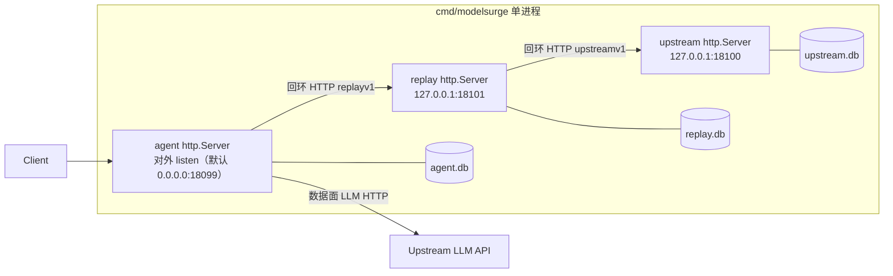

# ModelSurge 双模式部署设计

> 本文是设计文档，不含代码改动。模式一与模式二**各自独立设计**，各自的分期实施路线见文内「实施分期」章节。
> 选型调研实证（2026-09）：**new-api** = 默认 SQLite、`SQL_DSN` 切 MySQL/PG、Redis 可选（缓存/限流/会话）、集群 = 应用主从多节点 + 共享单库入口（DB 主从/ProxySQL 是部署侧可选增强，应用无感知）；**sub2api** = 强制 PostgreSQL 15+ + Redis 7+（缓存/队列）、无 DB 集群设计。

## 0. 总纲：两模式共享不变量

无论采用哪种模式，以下四条不变量必须成立，任何实施分期不得破坏：

1. **契约与数据面不变**：内部契约 `replayv1`/`upstreamv1` 与 Bearer 鉴权模型不变；严格 IR 不变式与出口 allowlist（`anthropic`/`openai-chat`/`openai-responses`/`codex`/`kiro`）不变；Agent 是唯一 LLM HTTP 发起者。
2. **三库逻辑唯一归属**：agent/replay/upstream 数据各有唯一写者，与物理形态（三 SQLite 文件 / PG 三 database）无关；跨库读取始终禁止。
3. **幂等与可靠上报**：`ApplyReport` 两段均按 `report_id` 幂等，且幂等记录与状态更新同事务；outbox 可靠上报只依赖主库，不依赖 Redis。
4. **调度语义不变**：流式首事件前可换目标、写出后锁定；调度策略名两模式同词同义——多副本收敛靠共享状态（PG/Redis），而不是改语义。
5. **单一核心代码**：两模式**不分叉代码**——共用同一份核心代码（`agent`/`replay`/`upstream` 三模块的共享包，含 PG 方言层与 Redis 热态）；差异只体现在**启动入口**（每个入口一个目录，目录内仅做装配）与运行配置，任何业务逻辑不得复制进入口目录。

---

## 第一部分：模式一 · 单进程模式（三合一 + SQLite）

**定位**：非 Docker/非服务器场景（个人桌面单二进制），零外部依赖，对标 new-api 默认 SQLite 体验。

### 1.1 形态与装配



**组合根**：新增 `cmd/modelsurge/`（单二进制启动入口，**纯编排壳**），import 三个模块——只做统一 YAML 加载、三服务按序拉起、回环地址装配、信号与关闭编排，不含任何业务逻辑；业务逻辑全部来自三模块共享包（「前置下沉改造」正是为了把装配依赖从各 cmd 的 main 导出为共享函数）。仓库根新增 `go.mod`（module `github.com/aceaura/ModelSurge`，replace 指向 `../agent`、`../replay`、`../upstream`，与子模块既有 replace 指令同构）。现有各服务 Dockerfile 只 COPY 子目录、在子目录内构建，根模块不影响现有镜像构建。

**两个启动入口，核心代码共用**：

| 启动入口 | 目录 | 职责 |
|---|---|---|
| 模式一 | `cmd/modelsurge/`（唯一新增目录） | 单二进制装配壳：三 section YAML、三服务编排、回环覆写、信号与 outbox flush |
| 模式二 | `agent/cmd/agent/`、`replay/cmd/replay/`、`upstream/cmd/upstream/`（现有目录，不变） | 各自加载各自 YAML，独立进程部署 |

两个入口 import 同一批共享包（service/schedule/store/codec 等）。驱动切换逻辑在共享的 `Open(driver, dsn)` 方言层内（Phase A 阶段为现有 `Open(path)`，Phase B 统一签名），不在入口里：模式二经 env 切 PG/Redis，模式一固定 SQLite。

**前置下沉改造**（否则根模块无法装配）：

| 现状 | 改造 |
|---|---|
| `upstream/internal/http` 为 internal 包 | 导出为 `upstream/adminapi` 包 |
| `kiroSetup` 位于 `upstream/cmd/upstream/main.go:22` | 下沉为导出函数（如 `processconfig.BuildKiroDeps`） |
| 兼容性 bootstrap 位于 `replay/cmd/replay/main.go:35`（BootstrapClientKey → Upstream Models → store.Bootstrap/AddMembers） | 下沉为导出函数供组合根复用 |

**进程内通信**：三服务走**回环 HTTP**——replay/upstream 绑 `127.0.0.1` 内部端口，Agent 经完整 `replayv1`/`upstreamv1` HTTP 契约调用。刻意放弃进程内直连适配器：避免双代码路径与契约漂移，单进程与三进程形态共用同一代码路径，契约零分歧。

**端口默认值**（全部可经 YAML 覆盖）：

| 服务 | 绑定 | 默认 | 说明 |
|---|---|---|---|
| agent | 对外 | `0.0.0.0:18099` | 沿用 agent.yaml `listen` |
| upstream | 回环 | `127.0.0.1:18100` | 沿用三进程容器内编号 |
| replay | 回环 | `127.0.0.1:18101` | 沿用三进程容器内编号 |

> 端口决策说明：brief 原文「默认 18099/18100」若按字面让 replay 占 18099，会与 Agent 对外监听 18099 冲突（`0.0.0.0` 含回环）。故取无冲突方案：三个编号全部沿用三进程形态现值，仅 replay/upstream 改绑回环；Agent 对外端口独立可配。

**SQLite**：维持**三个文件**（`agent.db`/`replay.db`/`upstream.db`），DSN `_pragma=busy_timeout(5000)&_pragma=journal_mode(DELETE)&_pragma=foreign_keys(ON)` 与 `SetMaxOpenConns(1)` 单写者语义原样保留（journal DELETE 同时满足 Windows/绑定挂载场景）。

**统一配置**：单份 YAML，`agent`/`replay`/`upstream` 三 section，字段与各进程现有配置一致；`os.ExpandEnv` 环境插值保留（现有 agent/replay config 加载器已具备）。三 section 内的 URL 字段（replay.upstream_url、agent.replay_url）由组合根强制覆写为回环地址，YAML 中出现即告警忽略，防止误指外部残留实例。

**编排**：启动顺序 upstream → replay → agent（等待内部 health 就绪再拉起下一个）；关闭反向：agent 停收流量 → outbox flush → replay → upstream。进程级信号处理统一在 `cmd/modelsurge`，三个子服务不再各自监听信号。

**outbox flush**：现状 `relay.RunOutboxWorker(sig, store, replay, time.Second)`（1s ticker）随信号退出，未发送报告留存 agent.db 待下次启动补报——该持久语义保持不变。组合根在关闭 Replay 之前追加一次**尽力 drain**（有限时限，如 5s）：把 outbox 中已持久化未上报的记录尽量推出；超时即放弃，交由既有持久语义兜底。flush 不引入新状态，只是把「下次启动补报」提前为「本次关闭前补报」。

### 1.2 语义保持

单进程下三服务各持各的 SQLite 连接，仍是各自库的唯一写者，全部现有语义天然保持，无需改造：

- `ApplyReport` 幂等（`result_reports` 唯一约束 + 同事务更新 `target_cache`）；
- `target_cache` 与组配置同事务域；
- sticky / round_robin / Half-Open 试探（单副本内存态即可）；
- Kiro `token_state` 轮换（单进程内无竞争）；
- outbox 1s ticker 与 report_id 全局幂等。

### 1.3 实施分期（Phase A，代码侧，非本次）

1. 导出 `upstream/internal/http` → `adminapi`；`kiroSetup`、replay bootstrap 下沉为导出函数。
2. 新增 `cmd/modelsurge/` + 根 `go.mod`（replace 指令）：统一 YAML 加载器（三 section）、三 `http.Server` 编排、信号与反向关闭、outbox 尽力 drain——入口目录只含装配代码，禁止引入业务逻辑。
3. 验收：单二进制桌面跑通 dispatch → LLM → report 全链路；三进程形态回归不破。

### 1.4 验证

- 单二进制启动后 Agent `/health` 200、内部两段 health 200。
- 真实请求链路成功（客户端协议 → IR → LLM → 响应），报告幂等落库（重复 report_id 无副作用）。
- `docker compose` 三进程形态回归测试全绿（exit code 判定）。

---

## 第二部分：模式二 · 集群模式（三进程拆分 + PostgreSQL + Redis）

**定位**：多副本水平扩展场景，完全对标两家选型：PG 为唯一权威存储、Redis 必需但纯易失。

### 2.1 形态与拓扑

三进程保持现有拆分与 HTTP 契约，**启动入口沿用现有三个 cmd 目录，不新建代码目录**。Compose 新增 `docker-compose.cluster.yml` override：`postgres:16-alpine` + `redis:7-alpine`，健康依赖链 postgres+redis → upstream → replay → agent。现有 `docker-compose.yml` 保留为「集群拓扑 + SQLite」中间形态（三进程分容器 + named volume，便于渐进迁移）。Phase B/C 的方言层与 Redis 热态改造全部落在共享 store/service 包内，模式一与模式二入口同时受益。

**PG 三库三 role**：`agent`/`replay`/`upstream` 各一个 database + 一个 role，role 只授本库权限——从部署层强制三库唯一归属。应用只配单个 DSN 入口；DB 主从/代理层 HA 留部署侧，应用不做读写分离/多数据源（new-api 实证：集群是应用多节点 + 共享单库入口，应用对 DB 拓扑无感知）。

**env 命名**：

```text
MODELSURGE_DB_DRIVER=sqlite|postgres
MODELSURGE_AGENT_DB_DSN=postgres://agent:.../agent
MODELSURGE_REPLAY_DB_DSN=postgres://replay:.../replay
MODELSURGE_UPSTREAM_DB_DSN=postgres://upstream:.../upstream
MODELSURGE_REDIS_ADDR= / MODELSURGE_REDIS_PASSWORD= / MODELSURGE_REDIS_PREFIX=modelsurge:
```

三份 DSN 分开配置、拒绝共享（配置加载校验三者互不相同）。

**多副本**：agent 可水平扩展（outbox 上报按 report_id 全局幂等）；replay/upstream 同样可多副本（PG 权威 + Redis 共享热态）。compose cluster 验证栈用 `deploy.replicas` 或 `--scale` 起双副本。

### 2.2 PG 方言层

**SQL 所有权表**（收编后全仓写 SQL 的包 = 4 个）：

| 包 | 库 | 现状入口 |
|---|---|---|
| `agent/agentstore` | agent.db | `Open(path)`（agent/agentstore/store.go:32） |
| `replay/relaystore` | replay.db | `Open(path)`（replay/relaystore/store.go:42） |
| `upstream/upstreamstore` | upstream.db | `Open(path)`（upstream/upstreamstore/store.go:69） |
| `upstream/account` | upstream.db（经 upstreamstore 共享连接） | `Open(path)` / `OpenDB(db)`（upstream/account/store.go:225/245） |

account 收编：`upstreamstore.Open` 打开连接后已调 `account.OpenDB(db)` 共享同一 `*sql.DB`——改造为把方言一并传入 `account.OpenDB`。Kiro 外部凭据库（`creds_file`/`cli_db` 加载路径）两处独立连接**维持 SQLite 不动**（它们是只读导入源，不是本系统状态）。

**方言助手**（4 包共用一个小 `dialect` 包）：

| 差异点 | SQLite | PostgreSQL |
|---|---|---|
| 占位符 | `?` | `$n`（rebind 按序重写） |
| upsert | `ON CONFLICT ... DO UPDATE/DO NOTHING` | 同形（SQLite 3.24+ / PG 9.5+ 兼容），统一经助手出口 |
| 自增主键 | `INTEGER PRIMARY KEY AUTOINCREMENT` | `BIGINT GENERATED BY DEFAULT AS IDENTITY` + `RETURNING` |
| 时间戳 | `INTEGER`（Unix 秒） | `BIGINT` |
| DSN | `file:path?_pragma=busy_timeout(5000)&_pragma=journal_mode(DELETE)&_pragma=foreign_keys(ON)` | 无 `_pragma`，池参数走 DSN/配置 |
| 连接池 | 恒 `SetMaxOpenConns(1)` | 按服务配置（默认 10） |

**迁移（SQLite → PG 单向）**：upstream 侧复用 `ImportLegacy` 的只读幂等模式（`mode=ro&_pragma=query_only(1)`，收敛为 `dialect.OpenSQLiteReadOnly`）读源库、按唯一约束幂等写目标库——已实施为 `upstreamstore.Migrate`（accounts 物化 → model_state/quota_state 覆盖 → result_reports 账本 → usage_log rowid 防重，整体经 `legacy_imports` 标记一次性）与 `upstream/cmd/migrate` CLI；replay 侧已实施 `relaystore.Migrate` + `replay/cmd/migrate` CLI（user_models/groups/members/result_reports，target_cache 可重建不迁）；agent 侧先排空 outbox 再切换（排空后 agent.db 无需迁移）。

### 2.3 取消单写者假设后的并发重设计

1. **upstreamstore.ApplyReport 失败计数**：现状 upsert `failures=excluded.failures`（整行覆盖，store.go:244）在并发下丢更新；改为原子表达式 `failures=failures+1`，退避计算配 `SELECT ... FOR UPDATE`。`result_reports` 唯一约束幂等兜底不变。
2. **relaystore.ApplyReport**：`ON CONFLICT(report_id) DO NOTHING` + `RowsAffected==0` 短路（store.go:176）天然并发安全，唯一约束即互斥，回归测试背书即可。
3. **Kiro token 轮换**：加分布式互斥——PG advisory lock（session 级 `pg_advisory_lock`，pinned 连接；刷新含跨 HTTP 长调用，不能持事务等网络，故不用 xact 级；锁粒度 = 账号名 hash），锁内重读库内 token state，他副本刚轮转过且未临期则整份采纳跳过。Redis 保持纯易失层，不参与凭据互斥。
4. **target_cache 并发写**：last-writer-wins，PG 行锁串行化单行更新；错误状态会被下一次 dispatch 的 evaluate 自愈，不破坏正确性。
5. **物化与运行态（实施修正）**：`MaterializeAccounts` 原先整账号先删后插——`model_state`/`quota_state` 的 FK `ON DELETE CASCADE` 会把熔断/冷却计数清零（单进程每次启动即丢；集群下任何副本重启清共享库）。已改为存续模型行 upsert、只删配置中已不存在的行；账号级冷却/禁用（accounts 列）不受影响，从未被物化触碰。

### 2.4 Redis 逐项归属（必需但纯易失，DB 权威）

| 状态项 | 归属 | 理由 |
|---|---|---|
| round_robin 游标 | Redis `INCR modelsurge:rr:{group}` | 易失可重建；多副本必须共享才保全局轮询 |
| Half-Open 试探 | Redis `SET NX PX` 试探锁（失败回退 rand 概率） | 多副本下 10% 概率放大 N 倍，须收敛为全局单试探 |
| API key 鉴权 | Redis 缓存（TTL 60s；PutUserModel/Delete 主动失效） | 每请求 SHA256 + DB 查询的热路径 |
| 熔断/冷却 | PG 权威 + Redis 读旁路（写 PG 后失效缓存） | 计数必须持久且原子；读是热路径 |
| target_cache | 留 PG | 与 ApplyReport 同事务域，拆走破坏原子性 |
| report outbox | 留 PG | exactly-once 依赖持久队列 + 幂等 |
| Kiro token_state | 留 PG（轮换用 advisory lock） | 凭据必须持久 |

### 2.5 多副本语义降级清单

| 语义 | 降级 |
|---|---|
| sticky / preset / failover | 无降级（position 在 PG，无状态） |
| round_robin | Redis 保全局；Redis 不可用降级副本内局部轮询（明示可接受） |
| Half-Open | 试探锁收敛全局；锁获取失败回退 rand 兜底 |
| ApplyReport 幂等 | 无降级（约束在 PG） |
| Agent outbox | 多副本安全（report_id 全局幂等），可水平扩展 |

### 2.5.1 实施修正（Phase C 落地）

1. **Half-Open 试探的真实位置**：原设计参照 `account.Manager.Next` 的 rand 10% 试探——该路径自三模块重构后已无生产调用方（调度改为 model 级 `Evaluate`），现行语义是冷却目标严格跳过。Phase C 把试探做成活语义并全局收敛：`Evaluate` 对熔断冷却目标 `SET NX PX probe:{model}`（TTL 60s）抢锁，抢到即放行；`Resolve`/`ExecuteKiro` 执行侧经 `EXISTS` 核验在途试探放行（Evaluate 与执行侧判定必须一致，否则试探请求会在执行侧被二次拒绝）。未配置 Redis（模式一）= 严格跳过（现行为不变）；配置但故障 = rand 10% 兜底（2.5）。
2. **试探资格按错误类判定**：`ApplyReport` 派生 `model_state.last_error_class`——显式冷却时刻（402 配额）= `cooldown_until`、401/403 = `auth`、429 = `rate_limit`、其余 = outcome。只对熔断退避类（outcome 类）试探；限流/鉴权/配额冷却试探只会浪费被拒请求，严格跳过。
3. **熔断读旁路粒度**：按 model id 缓存（`state:{id}` → `{found,enabled,cooldown,failures,class,account}` JSON，TTL 60s）；miss 批量回源一次 `ListModels` 并回填。`Report` applied 后 `DEL state:{target}` 主动失效——活跃目标的状态自愈即时；管理面账号变更（物化）不主动失效，TTL 60s 收敛，执行侧 `Resolve`/`ExecuteKiro` 恒读 PG 新鲜态兜底正确性。
4. **鉴权缓存**：`auth:{model}` → `"protocol|api_key_hash"`（与 DB 同信任边界，存的本就是 hash），TTL 60s；命中时协议匹配与常数时间比较在本地完成。`PutUserModel`/`DeleteUserModel` 主动 `DEL`；未配置/禁用模型缓存空值负条目（写路径失效保证即时生效）。
5. **rr 游标**：`INCR rr:{group}` → `(v-1) % n`；Redis 未配置/降级回退副本内局部游标（原 `cursors` map 语义不变）。
6. **模式一边界**：`cmd/modelsurge` 的 redis 段与 db_driver/db_dsn 同规则——出现即告警忽略（单副本无共享语义需求，保持零外部依赖）。
7. **降级开关（redisx）**：命令超时 500ms；任何命令错误进入 10s 熔断窗口，窗口内快速失败（不打网络、不拖慢热路径），窗口后半开重试；`New` 时 Ping 失败仅告警不阻断启动。所有使用方把 Redis 错误一律视为「未命中/降级」，DB 恒权威。

### 2.6 实施分期（代码侧，非本次）

- **Phase B（PG 方言层）**：4 包 `Open(driver, dsn)` 改造、account 收编、ApplyReport 计数原子化、迁移工具、cluster override。验收：同一测试套件两种 driver 全绿。
- **Phase C（Redis 热态）**：round_robin INCR、试探锁、鉴权缓存、熔断读缓存、advisory lock、降级开关。验收：双副本全局轮询；kill redis 后按降级表运行。（已实施：`upstream/redisx` 共享包 + replay 鉴权缓存/rr 游标 + upstream 读旁路/试探锁；advisory lock 已在 Phase B-2 落地。）

### 2.7 验证

- 双 driver 测试套件全绿（exit code 判定，禁止管道串联）。
- compose cluster 栈双副本端到端（客户端请求 → 全链路 200 → 双副本日志各自完整）。
- Redis 故障降级演练：kill redis，按 2.5 清单逐项核对行为与恢复。

---

## 3. 评审 checklist

### 3.1 选型对照（逐条标章节）

| 调研实证 | 本设计落点 |
|---|---|
| new-api 默认 SQLite、零依赖起步 | 模式一 1.1（单二进制 + 三 SQLite 文件） |
| new-api `SQL_DSN` 环境变量切库 | 2.1 `MODELSURGE_DB_DRIVER` + 三 DSN |
| new-api Redis 可选（缓存/限流/会话） | 2.4 Redis 必需但纯易失、逐项归属表（本系统限流/会话语义不同，故不照搬「可选」） |
| new-api 集群 = 应用多节点 + 共享单库，应用无感知 | 2.1 单 DSN 入口、不做读写分离/多数据源 |
| sub2api 强制 PG 15+ | 2.1 PG 16（三库三 role 更进一步：部署层强制库归属） |
| sub2api Redis 7+ 必需 | 2.4 同为必需，但明确「纯易失、DB 权威」边界 |
| sub2api 无 DB 集群设计 | 2.1 DB HA 留部署侧（同 new-api 实证） |

### 3.2 现有语义逐条：模式一如何保持 / 模式二如何保持

| 语义 | 模式一 | 模式二 |
|---|---|---|
| ApplyReport 幂等（同事务） | 天然保持：单进程单写者（1.2） | 唯一约束在 PG，天然并发安全；upstream 侧计数改原子表达式（2.3.1/2.3.2） |
| target_cache 与组配置同事务 | 天然保持（1.2） | 留 PG 同事务域（2.4）；并发写 last-writer-wins + 下次 dispatch 自愈（2.3.4） |
| sticky / round_robin / Half-Open | 天然保持：单副本内存态（1.2） | sticky 无状态保 PG；rr 游标 Redis INCR；试探锁 SET NX PX + rand 兜底（2.4/2.5） |
| Kiro token_state 轮换 | 天然保持：进程内无竞争（1.2） | 留 PG + advisory lock 互斥（2.3.3） |
| outbox 1s ticker 可靠上报 | 保持；关闭前追加尽力 drain（1.1） | 只依赖 PG，不依赖 Redis；多副本可水平扩展（2.4/2.5） |
| 首字节前可换目标/写后锁定 | 不变（总纲 4） | 不变（总纲 4） |
| Agent 唯一 LLM 发起者 | 不变（总纲 1） | 不变（总纲 1） |

### 3.3 方言清单抽查（4 包各 2 条）

| 包 | SQL（现状） | 行 | 改造点 |
|---|---|---|---|
| relaystore | `INSERT INTO target_cache ... ON CONFLICT(group_id) DO UPDATE SET upstream_model_id=excluded...` | store.go:160 | upsert 经方言助手；`?`→`$n` |
| relaystore | `INSERT INTO result_reports ... ON CONFLICT(report_id) DO NOTHING` + RowsAffected 门控 | store.go:176 | 同形兼容，仅 rebind；幂等门控不变 |
| upstreamstore | `ON CONFLICT(id) DO UPDATE SET ...`（upstream_models） | store.go:137 | upsert 助手 |
| upstreamstore | 冷却 upsert `failures=excluded.failures` | store.go:244 | **改原子表达式** `failures=failures+1` + FOR UPDATE（2.3.1） |
| agentstore | outbox `id INTEGER PRIMARY KEY AUTOINCREMENT, report_id TEXT NOT NULL UNIQUE` | store.go:44 | PG：IDENTITY + RETURNING |
| agentstore | 时间戳列 `INTEGER`（Unix 秒） | schema 全表 | PG：BIGINT |
| account | `Open(path)` SQLite DSN `_pragma` 三连 | store.go:225 | `Open(driver, dsn)` 化；`_pragma` 仅 SQLite 分支 |
| account | `OpenDB(db)` 共享 upstreamstore 连接 | store.go:245 | 收编：方言随 `*sql.DB` 传入（2.2） |
